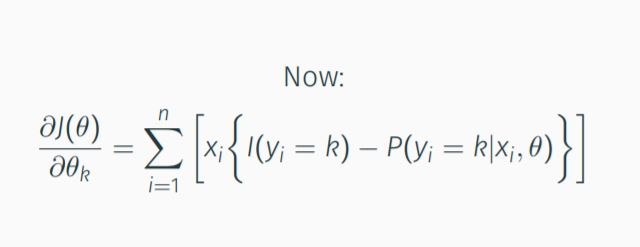
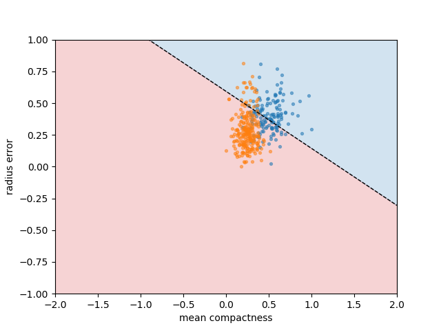

# ES654-2021 Assignment 3

*Dhruvi Lodhavia* - *18110050*

------

Here I found the vectorized logistic regression with the given update rules and with autograd

Using breast cancer dataset and K=3 folds present overall accuracy to be 90.1%

This is the decision boundary obtained for two features chosen randomly

