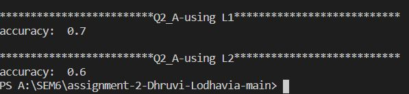
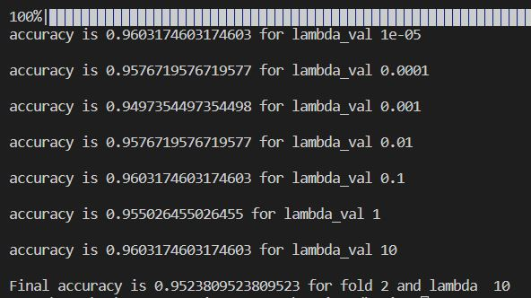
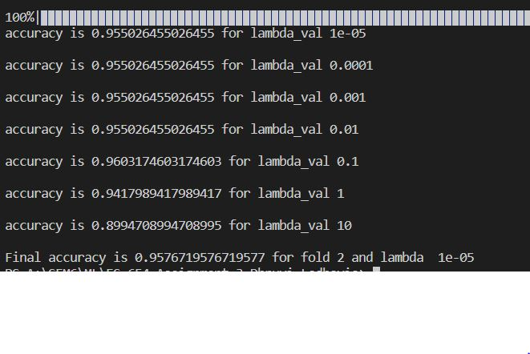
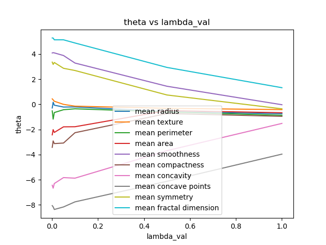

# ES654-2021 Assignment 3

*Dhruvi Lodhavia* - *18110050*

------

* Here I implemented logistic regression with L1 and L2 regularization using jax

The accuracies obatined for a random input dataset are - 

* for finding optimum lambda value, I used nested cross validation
For L1 regularisation-

The optimum lambda value is 10^-5

For L2 regularisation - 

The optimum lambda value is 0.01

*  From the L1 regularisation, to infer the “more” important features, i have plotted a few features with varying lambda values

more important features are features that do not go to 0 
the features - 
* mean concave points
* mean fractal dimension
* mean concavity
and so on...
