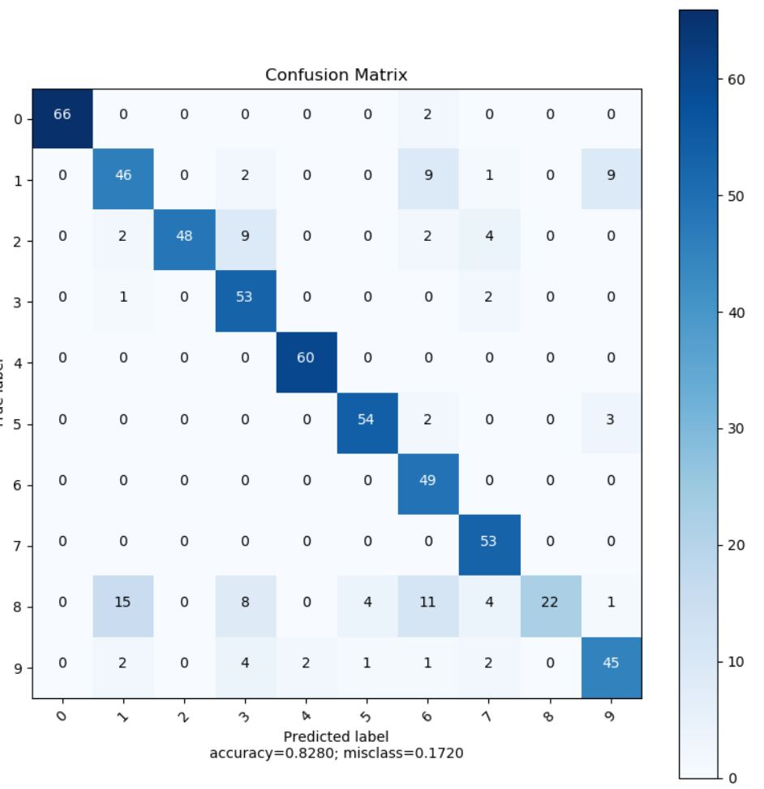

# ES654-2021 Assignment 3

*Dhruvi Lodhavia* - *18110050*

------
3. I implemented K-class Logistic regression using:
* Update rules in slides 
* Jax/Autograd 

* Using Digits dataset and stratified (K=4 folds) I visualized the confusion matrix and  overall accuracy is

1. Which two digits get the most confused? 
    * 8 got mispredicted as 1 most number of times, followed by 8 being mispredicted as 6
2. Which is the easiest digit to predict?
    * 0 is easiest to predict as can be seen from the confusion matrix

* Use PCA from sklearn I projected the digit data to 2 dimensions and make a scatter plot with different colours showing the different digits

This shows 1,6,4 are have similar distribution whereas 2,5,7,9 have similar distribution