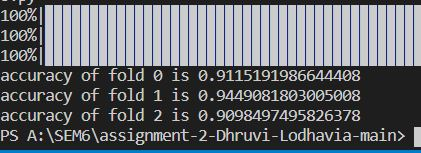
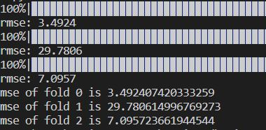

# ES654-2021 Assignment 3

*Dhruvi Lodhavia* - *18110050*

------
Here I created fully connected NN (MLP).
Testing it using 3 fold CV, on

1. digits dataset
A two layer network is chosen here such that activation function of 1st layer is sigmoid and final layer is softmax

2. boston dataset
A two layer network is chosen here such that activation function of 1st layer and final layer is relu

