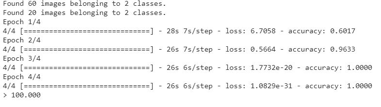
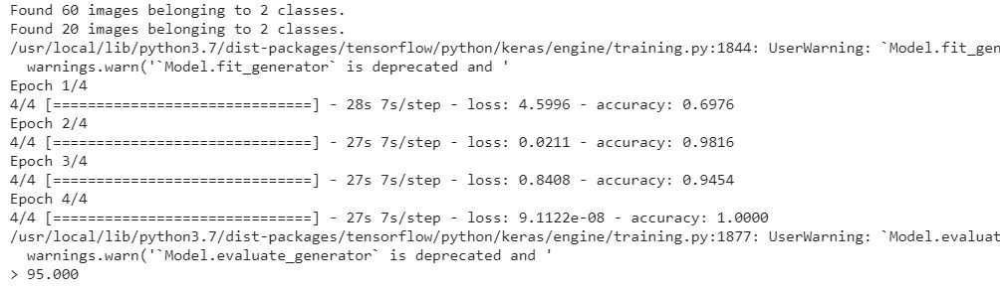
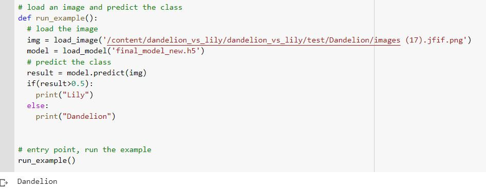

# ES654-2021 Assignment 3

*Dhruvi Lodhavia* - *18110050*

------
Submission- https://colab.research.google.com/drive/1KVYC8UrSwq1xo5KOi3plKD-F_dE1BLly?usp=sharing

* The accuracy of VGG1 without augmentation is - 

* The accuracy of VGG1 with image augmentation is- 

With image augmentation, the accuracy decreases as now, the model is not overfitting the dataset. This leads to a better model since right now, the test set is small and there are high chances the model will overfit the dataset.

* Prediction

